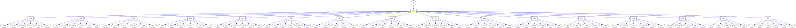
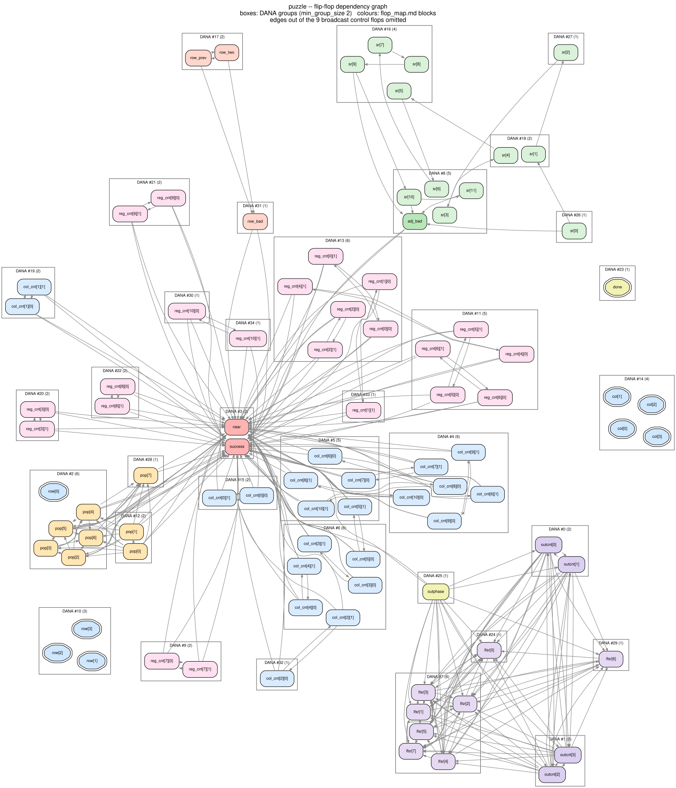
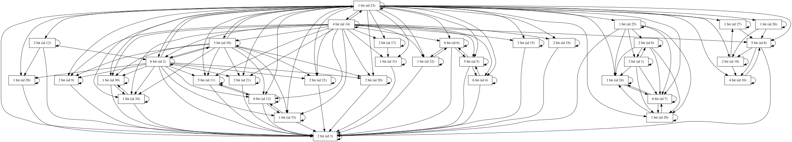
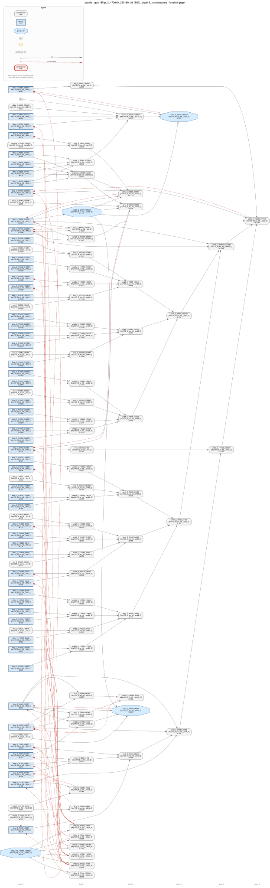
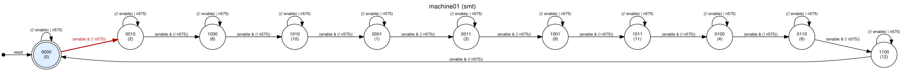

# Jane Street ASIC puzzle (2026) — full GDS-to-answer walkthrough

Reverse engineering of the [Jane Street ASIC puzzle](https://blog.janestreet.com/can-you-reverse-engineer-an-asic/)
([files](https://github.com/janestreet/asic-puzzle-2026)): a sky130 GDS layout of a chip
with ports `clk, rst_n, enable, I` → `O[7:0], success`, and the question *"what input makes
`success` go high?"*. This example takes the design from raw polygons all the way to the
verified answer, with every step validated against ground truth. It was solved after the
competition deadline (submissions closed 2026-09-04) as an educational exercise.

> **SPOILER WARNING** — this README and `artifacts/` contain the complete solution.

## Quick start

```sh
python tools/fetch_puzzle.py         # download puzzle.gds + warmup chain (not checked in)
pip install gdstk z3-solver
python tools/test_sc_sim.py          # 30 simulator self-tests
python tools/validate_warmup.py      # extractor vs. warm-up DEF ground truth: 100%
python tools/gds2netlist.py          # GDS -> artifacts/puzzle_netlist.{v,json}
python tools/replay_vcd.py           # netlist replays example_inputs.vcd exactly
python tools/solve_key.py            # z3: the unique 121-bit key
python tools/run_attempt.py          # feed the key, watch success go high
python tools/gen_sky130_hgl.py       # -> plugins/gate_libraries/definitions/SKY130_FD_SC_HD.hgl
```

## Loading the netlists in HAL

`tools/gen_sky130_hgl.py` turns the `sc_sim` cell table into a permanent HAL gate library,
`plugins/gate_libraries/definitions/SKY130_FD_SC_HD.hgl` (424 gate types; HGL format v4).
Every Boolean function is derived by symbolically evaluating the simulator's own cell
lambdas and then re-checked against them exhaustively, so the HAL library and the simulator
cannot drift apart. With it, both extracted netlists load straight into `hal_py`:

```sh
hal --import-netlist examples/janestreet_asic_2026/artifacts/puzzle_netlist.v \
    --gate-library plugins/gate_libraries/definitions/SKY130_FD_SC_HD.hgl \
    --project-dir /tmp/puzzle_hal --python
```

`tools/hal_load_check.py` is the regression: it re-derives every cell's truth table *through*
`hal_py` and cross-checks both parsed netlists against their JSON sidecars — 1618 gates /
739 nets / 92 flip-flops for the puzzle, 230 / 84 / 16 for the warm-up, with the `conb` cells
recognised as constant drivers. Output: `artifacts/hal_load_check.txt` (48 checks, all green).

`tools/hal_sim_replay.py` goes one step further and *runs* the chip inside HAL: it drives the
whole protocol through the `hal_simulator` engine of the `netlist_simulator_controller`
plugin for four payloads — the example VCD's failing attempt, the winning Star Battle key,
all-zeros and all-ones — and compares `O[7:0]` and `success` against `sc_sim` at every clock
edge. HAL matches the reference on all 141 edges of all four: `TRY AGAIN`, `(* TWO STARS *)`
with `success` high at the first edge after `enable` drops, `EMPTY SKY` and `BIG BANG`. So
HAL's async-set/reset flip-flop model is right on this design — the 84 `dfrtp_2`, the 4
`dfstp_2` that seed the LFSR with 0xA5, and the 4 unresettable `dfxtp_2`. The one thing the
harness has to do for HAL is drive the `conb` tie nets itself: `hal_simulator` never
evaluates a cell with no input pins and HAL's GND/VCC heuristic will not accept a cell with
two constant outputs, so the ties would stay `X` and poison the output byte stream. That, and
a `verilator`-engine failure found on the way, are written up in
`artifacts/hal_sim_issue_draft.md`. Output: `artifacts/hal_sim_replay.txt`.

## Method

1. **Extraction** (`tools/gds2netlist.py`) — purely geometric netlist recovery: std-cell pin
   shapes from the cells' own GDS labels, routing from polygons *and* PATH records, vias from
   `VIA_*` SREFs, all decomposed to integer-nm rectangles and merged with union-find over a
   spatial hash. **Validated to 100%** on the warm-up design against its DEF: 230/230
   instances, 285/285 pins, 84/84 nets bijective (`tools/validate_warmup.py`).
2. **Simulation** (`tools/sc_sim.py`) — dependency-free cycle-based simulator with the full
   sky130_fd_sc_hd cell library (AOI/OAI roster generated from one table so `*oi`/`*ai` are
   complements by construction), async set/reset flops, clock-tree auto-detection.
   Mutation-tested; proves itself on the warm-up (`A+B==496`) netlist.
3. **Ground truth replay** (`tools/replay_vcd.py`) — the extracted netlist driven by the
   stimulus in `example_inputs.vcd` reproduces the recorded outputs at **all 312 clock
   edges**, including the `TRY AGAIN` byte stream. Alignment shifts ±1/±2 all fail, so the
   match is not vacuous.
4. **Solving** (`tools/solve_key.py`) — symbolic simulation of the whole protocol over z3,
   `success == 1` asserted; and independently, **structural RE** (`tools/symbolic.py`,
   `tools/symlift.py`, `tools/flop_map.py`) lifting all 738 logic cells back to boolean
   equations, reading the hidden constant out of the gate cone, and solving it with plain
   backtracking (`tools/starbattle.py`). Both methods produced the identical answer.

## What the chip is

**A Star Battle judge.** There is no stored password and no comparator tree. The 121
`enable`-cycles of serial input are interpreted as an 11×11 grid bitmap (row-major), and the
chip checks five constraints in hardware:

- total population = 22 (8-bit popcount, decoded `== 0b00010110`),
- every row has exactly 2 stars, every column has exactly 2 stars,
- every *region* has exactly 2 stars — the region map is hard-wired as a ~130-gate cone
  mapping the (row, col) counters to a 4-bit region id (`artifacts/region_map.txt`),
- no two stars touch, even diagonally (a 12-deep input delay line checks the −1/−10/−11/−12
  taps).

The flop map (`artifacts/flop_map.md`): row/column counters, popcount, 11×2-bit column
counters, 11×2-bit region counters, delay line + touch flag, output-byte counter, an 8-bit
LFSR (poly x⁸+x⁶+x⁵+x⁴+1, seed 0xA5 — the four `dfstp` set-flops are exactly its 1-bits),
and verdict flops. The "output generator" region from the blog's hint picture holds five
messages: `TRY AGAIN` (fail), `EMPTY SKY` (all-zero input), `BIG BANG` (all-one input), a
near-miss easter egg (`TWO NOT TOUCH`), and the success message — which is **not** a ROM but
`lfsr ⊕ mask`, only decodable by actually solving the puzzle.

## The answer

The region map's Star Battle instance has a **unique** solution (113,758,570 grids satisfy
the counting constraints; the adjacency rule kills all but one — uniqueness confirmed
exhaustively by z3 model enumeration over the full 2^121 input space):

```
. . . . . . . * . * .          6 6 6 6 6 8 8 5 4 4 9
* . . . . * . . . . .          6 6 0 6 6 8 5 5 4 4 9
. . . . . . . * . * .          6 6 0 8 8 8 8 5 5 4 9
* . * . . . . . . . .          6 6 0 8 1 1 1 9 5 5 9
. . . . * . * . . . .          0 6 0 8 1 9 9 9 9 9 9
. . * . . . . . * . .          0 0 0 8 1 1 1 9 2 2 2
. . . . * . . . . . *          8 8 8 8 8 8 1 9 2 A A
. * . . . . * . . . .          8 7 7 7 1 1 1 9 2 A A
. . . * . . . . . . *          8 7 7 3 9 9 9 9 2 A A
. . . . . * . . * . .          8 8 7 3 3 9 9 9 2 2 2
. * . * . . . . . . .          8 7 7 3 9 9 9 9 9 9 9
   solution                       region map
```

121-bit payload (one bit per `enable` rising edge, row-major):

```
0000000101010000100000000000010101010000000000001010000001000001000000100000101000010000000100000010000010010001010000000
```

`success` asserts on the first edge after `enable` drops and `O` streams
**`(* TWO STARS *)`** — an OCaml comment, naturally. (LFSR digest of the winning payload is
0x65; XORed against the hard-wired mask it yields the message.)

The example VCD's "The night sky awaits" / 11-ASCII-char framing is a deliberate red
herring: the winning payload has non-zero "pad" bits and decodes to garbage as ASCII.

## Easter eggs and defects found along the way

- `INTERNAL_3`/`INTERNAL_7` cells on non-fab layer 200, placed *below* the die outline, are
  spatial Morse code (1:3 widths, ITU spacing): **`PER ARENAM AD ASTRA`** — "through the
  sand to the stars" (`artifacts/recon_notes.md`, `artifacts/layer200_markers.png`).
- 1366 floating met2 squares form three concentric rings — decoration (a star chart?).
- One net (`n278`) is genuinely unrouted in the GDS: the near-miss message prints
  `TWO"NOT TOUCH` instead of the intended `TWO NOT TOUCH`. It is unobservable on `success`
  and on every other message (`artifacts/replay_validation.txt`).
- The VCD's `$date` is the 2016-12-31 leap second.

## Files

| | |
|---|---|
| `tools/fetch_puzzle.py` | downloads the upstream puzzle files (not checked in — no license) |
| `tools/gds2netlist.py`, `validate_warmup.py` | extraction + ground-truth validation |
| `tools/sc_sim.py`, `test_sc_sim.py` | gate-level simulator + self-tests |
| `tools/gen_sky130_hgl.py` | generates HAL's `SKY130_FD_SC_HD.hgl` gate library from `sc_sim.py` |
| `tools/hal_load_check.py` | loads both netlists through `hal_py` and checks them against the sidecars |
| `tools/hal_sim_replay.py` | replays the protocol through HAL's `hal_simulator` engine and diffs it against `sc_sim` |
| `tools/replay_vcd.py`, `vcd_decode.py` | VCD replay validation / stimulus decoding |
| `tools/solve_key.py` | z3 symbolic solve (answer + uniqueness) |
| `tools/symbolic.py`, `symlift.py`, `flop_map.py`, `extract_region_map.py`, `starbattle.py` | structural RE path |
| `tools/run_attempt.py`, `reference.py`, `check_recovered*.py`, `tb_recovered.v` | verification harnesses |
| `tools/hal_walkthrough.py`, `run_hal_analysis.sh` | Act 2 — the same analysis through HAL's own passes |
| `recovered.v` | behavioral re-implementation of the whole chip (Icarus-verified vs. gate level) |
| `artifacts/` | reports: extraction, flop map, structure, solve, recon, replays, HAL walkthrough |
| `images/` | every picture Act 2 embeds (SVG + the DOT it was rendered from) |

Regenerable heavy outputs (`artifacts/puzzle_netlist.*`, `warmup_netlist.*`) are gitignored;
rerun the pipeline above to rebuild them.

## Act 2 — the same walkthrough inside HAL

Everything above was done with purpose-written Python. Act 2 asks a different question:
**how far does stock HAL get on the same netlist, with no puzzle-specific knowledge?**
The steps are the ones `ai/skills/re-walkthrough-method` prescribes — census, control-pin
signatures, gate-level SCCs, the register dependency graph, chains, then the tools — and
the hand-made `artifacts/flop_map.md` is used only as an *answer key*, never as an input.

```sh
# inside the halbuild container (HAL has no Windows build)
docker exec -e HAL_BASE_PATH=/work/build -e HAL_PY_PATH=/work/build/lib \
    -e PYTHONPATH=/work/build/lib -w /work halbuild bash -c \
    'bash examples/janestreet_asic_2026/tools/run_hal_analysis.sh'
```

That script runs `tools/hal_fsm analyze`, then `tools/hal_walkthrough.py` (steps 1–7, which
call `hal_py` and the `dataflow_analysis` plugin directly), then five `tools/hal_viz`
renders and two direct Graphviz layouts. Full transcript: [`artifacts/hal_walkthrough.txt`](artifacts/hal_walkthrough.txt);
machine-readable: [`artifacts/hal_dataflow.json`](artifacts/hal_dataflow.json).

### 1–2. Census, and what the control pins say

1618 gates, 739 nets, **one** module — the GDS kept no hierarchy — 69 gate types, 92
flip-flops. 880 of the 1618 gates (676 `tapvpwrvgnd_1`, 204 `decap_3`) have *no signal pin
connected at all*: a GDS extraction hands you the physical cells a synthesis export never
mentions, so the logic is 738 cells, not 1618. The flop families come back from the gate
library with their asynchronous behaviour attached — 84 `dfrtp_2` (reset `(! RESET_B)`),
4 `dfstp_2` (set `(! SET_B)`), 4 `dfxtp_2` (neither).

Grouping the flops by (clock, reset, set) net gives **16** distinct clock nets, which looks
like sixteen domains and is not: walking each back through single-input cells lands all 16
on `clk` at buffer depth 2. That is the clock tree, and `hal_viz clock_tree` draws it —
32 `clkbuf` cells over 92 flops.



The method expects step 2 to split registers by *enable* net. It cannot here: sky130's
`df*tp` family has no enable pin, so every gated register in this design is gated by a
multiplexer inside its D cone. The enable-group signal that makes this step productive on
an FPGA export simply does not exist in a standard-cell flow.

### 3–4. SCCs and the register graph — where the structure actually is

The cell graph has 51 non-trivial SCCs over the 738 logic cells (19×2, 1×3, 5×4, 22×6, and
one each of 9, 13, 34, 46). Lifting to the **flip-flop-only** dependency graph — 92 nodes,
709 edges, each meaning "this flop's D cone reads that flop's Q through combinational cells
only" — the decomposition is 25 singletons, 23 components of size 2, and one each of size
4, 8 and 9. 67 flops sit in a cycle; 25 can only pass a value along.

That decomposition *is* the design:

| FF-SCC | what `flop_map.md` calls it |
|---|---|
| size 9 | `col[0..3]` + `row[0..3]` + `done` — the scan-position core |
| size 8 | `lfsr[0..7]` |
| size 4 | `outcnt[0..3]` |
| 22 × size 2 | the eleven `reg_cnt[k]` and eleven `col_cnt[k]` 2-bit counters |
| 1 × size 2 | `row_prev` + `row_two` |
| 25 singletons | `pop[0..7]`, `sr[0..11]`, `adj_bad`, `row_bad`, `outphase`, `success`, `near` |

The direction between components is architecture, recovered before any name: the 4-flop
component feeds the 8-flop component and nothing comes back, i.e. a byte counter driving a
feedback register — a schedule driving a digest.

The shift-chain test ("D cone reads exactly one flop") finds **nothing**, in a design that
contains a 12-deep delay line. This is exactly the failure `13_trivium_stream` documents:
every stage reads its predecessor *and* the flop that gates the shift, so "exactly one" is
false for all twelve at once. The fix is the same one — hold the broadcast control out. Nine
flops appear in ≥25% of all D cones (the eight position-counter bits and `done`, `done`
alone in 87 of 92); removing them and re-running the test returns **one 12-stage chain**, in
exactly the hand map's `sr[11] ← … ← sr[0]` order, 12 of 12 names.



Boxes are DANA's groups, colours are `flop_map.md`'s functional blocks, so every
disagreement below is visible as a box that mixes colours or a colour split across boxes.
(Edges out of the nine broadcast flops are omitted; they run almost everywhere.)

### 5. DANA vs. the flop map

`dataflow_analysis` was run five ways. The row labelled *SCC baseline* is step 4's
decomposition used as a grouping — it costs one Tarjan pass and no plugin:

| configuration | groups | precision | recall | F1 | exact registers (of 36) |
|---|---|---|---|---|---|
| **SCC baseline** (step 4) | 51 | **0.73** | 0.42 | **0.53** | **29** |
| DANA, stock `with_flip_flops()` | 54 | 0.29 | 0.15 | 0.20 | 11 |
| DANA, `min_group_size 2` | 35 | 0.48 | 0.39 | 0.43 | 10 |
| DANA, `min_group_size 2` + expected size 2 | 51 | 0.58 | 0.22 | 0.32 | 15 |
| DANA, `min_group_size 2` + sizes 2/4/8/12 + type consistency | 53 | 0.62 | 0.21 | 0.31 | 15 |
| DANA, `min_group_size 2` + stage identification | 38 | 0.45 | 0.33 | 0.38 | 10 |

Precision/recall are over co-membership *pairs* (a grouping is right about a pair of flops
when it puts them together exactly when the hand map does); "exact" counts hand registers
whose bit set equals some recovered group's bit set. Per-register, best DANA run against
the baseline:

| hand register | bits | SCC baseline | DANA (`min_group_size 2`) |
|---|---|---|---|
| `col` | 4 | merged with `done`, `row` | **exact** |
| `row` | 4 | merged with `col`, `done` | split across 2 groups |
| `done` | 1 | merged with `col`, `row` | **exact** |
| `pop` | 8 | split across 8 groups | split across 3 groups |
| `col_cnt[0..10]` | 2 each | **exact ×11** | exact ×2, merged ×3, split ×6 |
| `reg_cnt[0..10]` | 2 each | **exact ×11** | exact ×4, merged ×4, split ×3 |
| `sr` | 12 | split across 12 groups | split across 5 groups |
| `adj_bad` | 1 | **exact** | merged with `sr` |
| `lfsr` | 8 | **exact** | split across 3 groups |
| `outcnt` | 4 | **exact** | split across 2 groups |
| `outphase` | 1 | **exact** | **exact** |
| `row_bad` | 1 | **exact** | **exact** |
| `row_prev`, `row_two` | 1 each | merged into one pair | merged into one pair |
| `success`, `near` | 1 each | **exact ×2** | merged into one pair |

Full table, all 36 rows, plus DANA's own group listing:
[`artifacts/hal_walkthrough.txt`](artifacts/hal_walkthrough.txt) and
[`artifacts/hal_dataflow.txt`](artifacts/hal_dataflow.txt).
DANA's own drawing of the 35 groups (it labels them by width and id, nothing else):



### 6. The success cone

`success` is not a combinational output — a `dfrtp_2` drives the port directly. Its D cone is
**47 combinational cells over 57 flip-flops and no primary input**, and that register list
*is* the judging rule, recovered by one backward walk:

`pop[0..7]` (8) · `col_cnt[0..10]` (22) · `reg_cnt[0..10]` (22) · `row_bad` · `adj_bad` ·
`done` · `outphase` · `success` itself (sticky).

Population, every column count, every region count, the row-count flag, the adjacency flag,
and the phase — five constraints and a gate, with no puzzle knowledge applied. Transitively
79 of 92 flops can influence `success`; the 13 that cannot are exactly `lfsr[0..7]`,
`outcnt[0..3]` and `near` — the message generator, provably downstream-only.



132 gates, 6 levels, 31 edges cut at a register
(`hal_viz dag --gate dfrtp_2_172040_280160 --depth 6 --direction predecessors`); the
[depth-2 close-up](images/hal_success_closeup.svg) is the 21 gates within two hops of it.

### 7. `hal_fsm`, and the one place HAL beat the hand analysis on its own

`tools/hal_fsm analyze --targets 2` proposed eight candidate state registers from feedback
structure (`heuristic`), flagged the choice as ambiguous, solved the top one, and returned:

> `fsm/machine01/reachable-states` — *proven_under_assumptions* — 11 of 16 encodable states
> are reachable from the initial state `0000`
>
> `fsm/machine01/transitions` — *proven_under_assumptions* — 11 states, 22 transitions,
> derived by SMT exploration
>
> `fsm/machine01/relation-consistency` — *proven_under_assumptions* — every one of the 44
> enumerated input assignments enables exactly one successor

The state register is the four flops the hand map calls `col[0..3]`; the transition relation
is conditioned on `enable` and on net `n575`, which the map calls `done`. Re-index the
states by those bit names — a relabelling, not a fit, since the state set and the relation
came from the solver — and the machine is:

```
states 0..10,   0→1→2→…→9→10→0 on (enable & !done),   hold otherwise
```

**A modulo-11 counter, proven from the netlist alone.** 11 is the grid width; the whole
Star Battle hypothesis starts there, and this is the only step of Act 2 that produced it
without being told.



The tool is equally clear about what it did *not* establish: three `unsupported` findings
say the asynchronous control inputs are driven by logic and not modelled, that the relation
depends on a signal outside the state register, and that sequential gates exist which no
solved machine covers. All of that is true.

### Where HAL's automation fell short of the hand analysis

- **DANA lost to forty lines of Tarjan.** On a design whose registers are 1–2 bits wide,
  the plugin built for word-level register recovery scored F1 0.43 and 10 exact registers
  against the SCC baseline's 0.53 and 29. Its stock configuration (`min_group_size` 8, i.e.
  "penalise anything narrower than a byte") is the worst of the six at F1 0.20. The
  defaults encode an assumption about datapath width that a bit-serial judge violates.
- **But DANA's errors are under-merging, not mis-merging.** 32 of its 35 groups are pure
  with respect to a functional block, and its precision against the coarse 13-block map is
  0.87 — it essentially never claims two unrelated registers are one word. It refuses to
  commit, rather than committing wrongly, which is the right failure direction.
- **Neither pass recovers a feed-forward register.** The 8-bit popcount is a ripple counter
  and the 12-bit delay line is a shift register; neither has feedback, so SCC sees 8 (resp.
  12) singletons and DANA fragments them into 3 (resp. 5) groups. Only step 4's chain walk
  gets the delay line, and only after the gating flop is held out. The popcount was never
  recovered as a word by anything in Act 2 — Act 1's symbolic lifting found it.
- **`hal_viz dag` on the whole netlist produces numbers, not a picture.** 1612 gates, 1905
  edges, 15 levels, 184 edges cut at a register — all useful; the SVG is 4063×77164 pt and
  unreadable, because the 880 degree-zero fill cells stack into a single level-0 column.
  The skill's documented size limits are about gate count and depth×fan-out; a
  GDS-extracted netlist adds a third failure mode the skill does not mention. Every picture
  above is therefore scoped or register-level. (The `.dot` is not committed; `run_hal_analysis.sh`
  regenerates the counts with `-f none`.)
- **`clock_tree_extractor` logs one error per gate on any imported netlist.** It emitted
  109 `invalid coordinate format: stoi` lines here — one per drawn gate:
  `clock_tree.cpp:465` reads
  `generic/X`,`generic/Y` gate data that a Verilog import never carries, catches the throw,
  and logs an *error* for what is a normal absence. The tree it draws is correct. Doubly
  ironic on this netlist, where every instance name literally *is* its coordinate.
- **Scoped views inherit the clock tree.** `netlist_graph --gate <flop> --depth 2` returns
  21 gates around the verdict flop, and three of them are `clkbuf` cells reached only
  through `CLK` — a graph walk has no notion of a control pin, so the clock tree leaks into
  every close-up of a sequential element.
- **Nothing HAL produced is a *name*.** The 92 flops come back as the extractor's
  coordinate strings and the register groups as integers; `fsm/machine01` is "eleven
  states", not "the column counter". Every semantic label in the tables above comes from
  Act 1. HAL recovered the *shape* of the machine — which flops move together, which feed
  the verdict, which counter is mod-11 — and that shape is genuinely most of the work. It
  did not recover what any of it is *for*.
