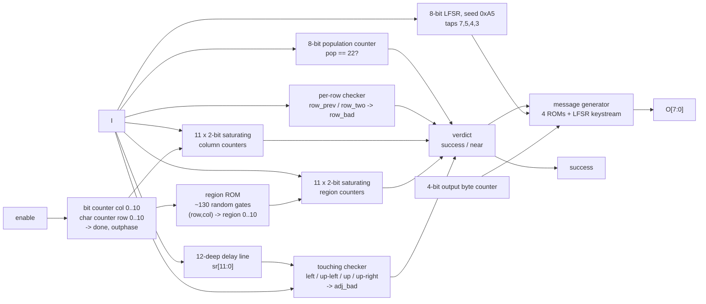

# What is this chip?

**It is a Star Battle judge.**

The 121 serial bits that the tester shifts in are not a message at all — they
are an **11 x 11 grid read row-major**, one bit per cell, `1` = star.  The chip
raises `success` if and only if the grid is a valid solution of the *Star
Battle* puzzle whose region map is frozen into ~130 gates of random logic:

* exactly **2 stars in every row**,
* exactly **2 stars in every column**,
* exactly **2 stars in every one of 11 irregular regions**,
* **22 stars total**,
* **no two stars touch**, not even diagonally.

That puzzle has exactly one solution.  Feeding it in makes the chip answer

```
success = 1      O[7:0] = "(* TWO STARS *)"
```

The success text is *not* a constant anywhere in the layout.  While the grid
streams in, an 8-bit LFSR seeded with `0xA5` digests every payload bit, and the
message is emitted as **that LFSR XORed with a fixed per-byte mask** — so the
answer only falls out once the puzzle itself is solved.  (Final digest for the
correct grid: `0x65`.)

Everything below was obtained by lifting the extracted gate netlist back to
equations and reading them; **no SAT solver was used**.  The grid was solved
with plain backtracking (`tools/starbattle.py`, milliseconds).

---

## 1. Method

| step | tool | output |
|---|---|---|
| lift 738 logic cells to boolean equations over the 92 flop outputs and the 4 primary inputs | `tools/symbolic.py`, `tools/symlift.py` | `artifacts/structured_eqs.txt` |
| name and group the 92 flops from the shape of their next-state equations, cross-checked against placement | `tools/flop_map.py` | `artifacts/flop_map.md` |
| evaluate the 4-bit "bucket select" cone for all 121 (row, col) pairs | `tools/extract_region_map.py` | `artifacts/region_map.txt` |
| solve the resulting Star Battle by backtracking | `tools/starbattle.py` | `artifacts/solution.txt` |
| replay through the gate-level simulator, read the message | `tools/run_attempt.py` | `success = 1` |
| behavioural model + equivalence check | `recovered.v`, `tools/reference.py`, `tools/check_recovered*.py` | 233/233 Python, 24/24 Verilog |

`tools/symlift.py` reuses the validated cell-function table from `sc_sim.py`
verbatim: each cell's Python lambda is evaluated with symbolic operands that
overload `&`, `|`, `^` and `1 - x`.  The lifted equations are therefore exactly
as trustworthy as the simulator that was validated against the warmup design.

---

## 2. Block diagram



ASCII version of the same thing, with the physical position of each block
(die is 200 x 300 um; `x%` is measured from the left edge of the layout):

```
   x 13..17%            x 37..44%             x 57..62%           x 70..99%
 +-------------+   +------------------+   +---------------+   +-----------------+
 | col counter |   | population ctr   |   | 11 region     |   | region ROM      |
 | 0..10  (4)  |-->| 22? (8 flops)    |   | counters (22) |<--| ~130 gates of   |
 |             |   +------------------+   +---------------+   | random logic    |
 | row counter |   | per-row checker  |   | 11 column     |   +-----------------+
 | 0..10  (4)  |   | (3 flops)        |   | counters (22) |   | message LFSR (8)|
 |             |   +------------------+   +---------------+   | out byte ctr (4)|
 | done flag   |   | 12-deep delay    |                       | 4 message ROMs  |
 +-------------+   | line (12) + adj  |                       | success/near (2)|
                   | flag (1)         |                       | outphase (1)    |
                   +------------------+                       +-----------------+
```

The block labelled *output generator* in `layout.png` (x ≈ 74–94 %,
y ≈ 74–260 um) is exactly the right-hand column above: the message LFSR, the
output byte counter, the four canned-message ROMs and the `success` / `near`
flops.  `success` is placed at (172.0, 280.2) um, right under the `success` pad
label at the top right of the layout.

---

## 3. Flop map (92 flip-flops)

Full table with cell types, instance names and placement:
[`artifacts/flop_map.md`](flop_map.md).  Summary:

| group | flops | Q nets | placement (um) |
|---|---|---|---|
| **bit counter** `col[3:0]`, 0..10 | 4 | `n86,n6,n93,n182` | x 26–31, y 144–158 |
| **character counter** `row[3:0]`, 0..10 | 4 | `n87,n89,n88,n102` | x 29–33, y 92–109 |
| **population counter** `pop[7:0]` | 8 | `n213,n146,n147,n173,n130,n142,n189,n204` | x 76–83, y 35–57 |
| **per-row checker** | 3 | `n327` (low bit), `n312` (high bit), `n284` (sticky fail) | x 79–82, y 92–109 |
| **input delay line** `sr[11:0]` | 12 | `n468 … n456` | x 75–85, y 133–163 |
| **touching flag** | 1 | `n418` | 87.9, 149.6 |
| **region star counters** (11 x 2 bit, saturating) | 22 | `n205/n176 … n407/n422` | x 114–123, y 46–147 |
| **column star counters** (11 x 2 bit, saturating) | 22 | `n547/n533 … n720/n721` | x 113–116, y 182–286 |
| **message LFSR** `lfsr[7:0]` | 8 | `n509,n562,n524,n500,n513,n550,n522,n499` | x 167–175, y 177–199 |
| **phase** | 2 | `n575` = done, `n665` = outphase | (29.9, 201.3) and (167.9, 282.9) |
| **output byte counter** `outcnt[3:0]` | 4 | `n252,n245,n246,n291` | x 168–170, y 242–253 |
| **verdict** | 2 | `success`, `n680` = near miss | x 168–172, y 272–280 |

Cell-type correlation confirms the grouping:

* the four `dfstp_2` (set-to-1 on reset) cells are **exactly** `lfsr[0]`,
  `lfsr[2]`, `lfsr[5]`, `lfsr[7]` — i.e. the LFSR seed is `0b10100101 = 0xA5`;
* the four `dfxtp_2` (no reset) cells are **exactly** the output byte counter,
  which is safe because its D inputs are gated by `outphase`, which does reset;
* every other flop is `dfrtp_2` (reset to 0).

The physical clustering is textbook: the two sequencing counters sit against
the left edge, the grid-checking datapath in the middle third, the 44 bucket
counters in one tall column at x ≈ 113–116 um (regions in the lower half,
columns in the upper half), and the whole message path on the right.

### How each group was identified from its equations

* **shift chain** — `D = Q` of the previous flop through an enable mux:
  `n456 <= n192 & n419 | n456 & !n192`, repeated 12 times, source `I`.
* **binary counters** — a toggle ladder: bit *k* toggles on the AND of all
  lower bits.  `col`: `n86 <= n192 ^ n86`, `n6` toggles on `n192 & n86`,
  `n93` on `n192 & n6 & n86`, `n182` on `n192 & n6 & n86 & n93`, and the whole
  thing is cleared by `n292 = (col == 10)`.
* **saturating 2-bit counters** — the 22 identical pairs
  `hi' = hi | (C & lo)`, `lo' = (C | lo) & (hi | !(C & lo))`, i.e.
  `cnt = min(cnt+1, 3)` when `C`.
* **LFSR** — the only flop group whose D cone contains XOR trees over *other*
  members of the same group.

---

## 4. The comparator — there isn't one

There is **no** per-character or per-bit comparison against a stored secret,
no XNOR tree and no wide AND of true/inverted flop outputs against a constant.
The task hint ("an 11-character ASCII key") is what the *framing* of the
example VCD suggests; the silicon says otherwise.  What the chip actually does
is accumulate five independent **counting** constraints and AND their
"all correct" decodes together.

The single place where a fixed value is compared is the population counter:

```
n145 = !(n142 | n173 | n189 | n204 | n213)      // pop[5],pop[3],pop[6],pop[7],pop[0] == 0
n144 = n130 & n145 & n146 & n147                // pop[4] & pop[1] & pop[2]
                                                // => pop == 0b00010110 = 22
```

and the equivalent "== 2" decode repeated 22 times over the bucket counters:

```
n79  = n176 & n218 & n221 & n231 & n239 & n240 & n262 & n264 & n301 & n334
     & n352 & n363 & n364 & n378 & n422
     & !n205 & !n242 & !n271 & !n331 & !n355 & !n376 & !n407      // 11 regions == 2
n713 = n533 & n584 & n585 & n604 & n610 & n619 & n654 & n656 & n660 & n672
     & n693 & n704 & n705 & n706 & n721                           // 11 columns == 2
     & !n547 & !n627 & !n661 & !n678 & !n695 & !n710 & !n720
     & n575 & !n665 & n79
success <= !n418 & (n144 & !n284) & n713 | success & !(n575 & !n665)
```

(`n221 = !n223`, `n239 = !n225`, `n262 = !n288`, `n364 = !n365`,
`n585 = !n583`, `n610 = !n599`, `n656 = !n652`, `n705 = !n700` — the low bit of
each 2-bit counter is required to be **0** and the high bit **1**, i.e. the
count is exactly 2.)

`n575 & !n665` is true for exactly one cycle — the clock edge right after the
121st payload bit — so the verdict is latched once and then held.

### The four constraint checkers in detail

**(a) Per-row: exactly two stars.**  Two flops encode the running star count of
the current character, saturating at 3:

```
row_two' = row_two | (I & row_prev)                              // n312
row_prev'= (I | row_prev) & (!(I & row_prev) | row_two)          // n327
    (row_two,row_prev) = 00,01,10,11  ->  count 0,1,2,>=3
```
both are cleared at `col == 10`, and on that same edge the sticky failure flag
is set unless the count is exactly 2:
```
row_bad' = row_bad | (col==10 & enable & ( (!(I & row_prev) & !row_two)      // total < 2
                                         | (row_two & (I | row_prev)) ))     // total > 2
```

**(b) Per-column: exactly two stars.**  Eleven 2-bit saturating counters, each
enabled by `I & enable & (col == k)`; the eleven `col == k` decodes are the
literal terms `n558, n578, n590, n634, n647, n662, n687, n690, n699, n715,
n725`.

**(c) Per-region: exactly two stars.**  Same structure, but enabled by
`I & enable & (region == k)` where `region` is the 4-bit value
`{n216,n207,n199,n165}` produced by ~130 gates from the two counters.  That
cone is the **region map ROM** (section 5).

**(d) No touching.**  The 12-deep delay line gives the four already-seen
neighbours of the current cell, and one gate collects them:

```
adj_bad' = adj_bad | ( I & enable & (  (col != 0)  & sr[11]      // up-left   (-12)
                                     | (col != 0)  & sr[0]       // left      (-1)
                                     | (col != 10) & sr[9]       // up-right  (-10)
                                     |               sr[10] ) )  // up        (-11)
```

Checking only backwards in scan order covers every adjacent pair exactly once —
a neat, cheap encoding of the Star Battle adjacency rule.

---

## 5. The recovered constant: the region map

Evaluating `{n216,n207,n199,n165}` over all 121 states of the two counters
(`tools/extract_region_map.py`) gives an exact 11-region partition of the grid —
this is the real "secret constant" baked into the die:

```
rows = character index 0..10, columns = bit index 0..10

  6 6 6 6 6 8 8 5 4 4 9        region sizes
  6 6 0 6 6 8 5 5 4 4 9          0: 8   1: 11  2: 9
  6 6 0 8 8 8 8 5 5 4 9          3: 4   4: 5   5: 7
  6 6 0 8 1 1 1 9 5 5 9          6: 14  7: 8   8: 21
  0 6 0 8 1 9 9 9 9 9 9          9: 28  A: 6
  0 0 0 8 1 1 1 9 2 2 2
  8 8 8 8 8 8 1 9 2 A A
  8 7 7 7 1 1 1 9 2 A A
  8 7 7 3 9 9 9 9 2 A A
  8 8 7 3 3 9 9 9 2 2 2
  8 7 7 3 9 9 9 9 9 9 9
```

Every cell maps to exactly one of 11 labels and the labels are contiguous
shapes — strong independent evidence that the read-out is correct.

### The unique solution

```
6 6 6 6 6 8 8 * 4 * 9          stars (row: columns)
* 6 0 6 6 * 5 5 4 4 9            0: 7, 9      6: 4, 10
6 6 0 8 8 8 8 * 5 * 9            1: 0, 5      7: 1, 6
* 6 * 8 1 1 1 9 5 5 9            2: 7, 9      8: 3, 10
0 6 0 8 * 9 * 9 9 9 9            3: 0, 2      9: 5, 8
0 0 * 8 1 1 1 9 * 2 2            4: 4, 6     10: 1, 3
8 8 8 8 * 8 1 9 2 A *            5: 2, 8
8 * 7 7 1 1 * 9 2 A A
8 7 7 * 9 9 9 9 2 A *
8 8 7 3 3 * 9 9 * 2 2
8 * 7 * 9 9 9 9 9 9 9
```

Payload (121 bits, row-major, first bit shifted in first):

```
0000000101010000100000000000010101010000000000001010000001000001
000000100000101000010000000100000010000010010001010000000
```

The solution is unique *with* the touching rule.  Without it there are
113 758 570 grids that satisfy all the counting constraints — which is why the
adjacency checker exists and why a dedicated near-miss message exists too.

Note that this payload can **not** be written as 11 ASCII characters in the
`8 data bits LSB-first + 3 zero pad` framing that the example VCD uses: every
bit position, including 8, 9 and 10, must carry exactly two stars, so the pad
bits cannot be zero.  The "11-character key" reading of the protocol is a red
herring planted by the example stimulus.

---

## 6. The output generator

`O[7:0]` is purely combinational from `outphase`, the 4-bit output byte
counter, the verdict flops, the population counter and the LFSR.  There are
five messages:

| condition | message | how it is stored |
|---|---|---|
| `pop == 0` | `EMPTY SKY` | ROM (random logic decode of `outcnt`) |
| `pop == 121` | `BIG BANG` | ROM |
| `success` | `(* TWO STARS *)` | **`lfsr ^ mask[outcnt]`** |
| `near` (all counts right, stars touch) | `TWO"NOT TOUCH` (see below) | ROM |
| otherwise | `TRY AGAIN` | ROM |

The mode select is a 3-bit code `{n613,n614,n615}` computed from
`pop == 0`, `pop == 121`, `success` and `near`; its five one-hot decodes
(`n636, n629, n591, n595, n611`) gate the five message sources.  The byte
counter `{n291,n246,n245,n252}` counts 0..15, freezes at 15, and `n666 =
(outcnt != 15)` blanks the output afterwards — so a message is at most 15 bytes
and the tail is NUL-padded.

The success keystream mask (extracted symbolically, one byte per `outcnt`):

```
4d ad fb 83 13 79 1c b5 79 63 c7 68 93 f5 8f 00
```

and each output bit is tied to exactly one LFSR bit (`O[j] = lfsr[j] ^
mask[outcnt][j]`, with `O[0]↔n509 … O[7]↔n499`).

**LFSR behaviour.**  Seed `0xA5` (the four `dfstp_2` cells).  During the input
phase it is a plain Fibonacci LFSR with the payload bit mixed in:

```
lfsr <= {lfsr[6:0], I ^ lfsr[7] ^ lfsr[5] ^ lfsr[4] ^ lfsr[3]}    // x^8+x^6+x^5+x^4+1
```

During read-out it keeps running with a *different* set of equations — the
synthesiser has collapsed **eight** free-running steps into one cycle, so the
chip produces one whole keystream byte per emitted byte:

```
lfsr[7] <= lfsr[7]^lfsr[5]^lfsr[4]^lfsr[3]     lfsr[3] <= lfsr[7]^lfsr[5]^lfsr[4]^lfsr[1]^lfsr[0]
lfsr[6] <= lfsr[6]^lfsr[4]^lfsr[3]^lfsr[2]     lfsr[2] <= lfsr[7]^lfsr[6]^lfsr[5]^lfsr[0]
lfsr[5] <= lfsr[5]^lfsr[3]^lfsr[2]^lfsr[1]     lfsr[1] <= lfsr[7]^lfsr[6]^lfsr[3]
lfsr[4] <= lfsr[4]^lfsr[2]^lfsr[1]^lfsr[0]     lfsr[0] <= lfsr[6]^lfsr[5]^lfsr[2]
```

That flat form is bit-identical, for all 256 states, to applying the one-bit
step above eight times with `I = 0` — verified exhaustively — which is how
`recovered.v` writes it.  It also tells you what the original RTL looked like:
a bit-serial LFSR clocked once per message *bit*, retimed by synthesis into a
once-per-*byte* update.

For the correct grid the digest after 121 bits is `0x65`, and the read-out
sequence `65 87 db d7 44 36 3c e6 2d 22 95 3b b3 df a6` XORed with the mask
above spells `(* TWO STARS *)`.

### The unrouted net `n278` is a bug in an easter egg

`n278` — the one net in `puzzle.gds` with no driver — feeds only `O[1]` and
`O[4]`, and only through the `near` message ROM.  Forcing it either way leaves
`success`, `TRY AGAIN`, `EMPTY SKY`, `BIG BANG` and `(* TWO STARS *)` bit-identical.
On the near-miss path it matters at four byte positions:

| `outcnt` | `n278 = 0` | `n278 = 1` |
|---|---|---|
| 3 | `0x22` `"` | `0x20` space |
| 12 | `0x48` `H` | `0x4a` `J` |
| 13 | `0x00` | `0x02` |
| 14 | `0x00` | `0x10` |

So the intended driver must be high at byte 3 and low at bytes 12–14 — i.e. a
decode of `outcnt == 3` — and the message the designers meant to print is
**`TWO NOT TOUCH`**.  Because the net was dropped in routing, the fabricated
chip prints `TWO"NOT TOUCH` instead.  It has no effect on the puzzle answer.

---

## 7. Deliverables and validation

| file | what |
|---|---|
| `recovered.v` | behavioural model, identical interface (`clk, rst_n, enable, I, O[7:0], success`) |
| `tools/reference.py` | Python twin of `recovered.v` |
| `tools/symbolic.py`, `tools/symlift.py` | gate-netlist → boolean-equation lifter |
| `tools/extract_region_map.py` | region map read-out |
| `tools/starbattle.py` | backtracking solver (no SAT) |
| `tools/run_attempt.py` | drive the extracted netlist through one attempt |
| `tools/flop_map.py` | flop naming/grouping table |
| `tools/check_recovered.py` | reference.py vs gate netlist, cycle by cycle |
| `tools/check_recovered_v.py`, `tools/tb_recovered.v` | recovered.v (Icarus) vs gate netlist |
| `artifacts/structured_eqs.txt` | the whole design as ~350 readable equations |
| `artifacts/region_map.txt`, `artifacts/solution.txt`, `artifacts/flop_map.md` | recovered constants |

Equivalence results (O[7:0] and `success` compared on **every** rising edge of a
full attempt: 3 reset edges, 1 idle, 121 payload, 20 read-out):

```
tools/check_recovered.py  -n 150 :  233/233 stimuli match
tools/check_recovered_v.py -n 20 :   24/24  stimuli match
```

Stimuli include the shipped example payload (`TRY AGAIN`), the Star Battle
solution (`success = 1`, `(* TWO STARS *)`), all-zeros (`EMPTY SKY`), all-ones
(`BIG BANG`), single-bit perturbations of the solution, uniform random vectors
and random weight-22 vectors.  The `near` path was reached separately with a
grid that satisfies every count but has two touching stars, and it reproduces
`TWO"NOT TOUCH` in both the gate netlist and the model.
